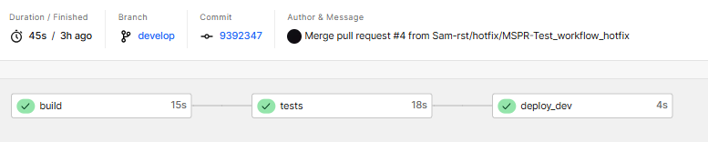

# Next.js + Jest

This example shows how to configure Jest to work with Next.js.

This includes Next.js' built-in support for Global CSS, CSS Modules and TypeScript. This example also shows how to use Jest with the App Router and React Server Components.

> **Note:** Since tests can be co-located alongside other files inside the App Router, we have placed those tests in `app/` to demonstrate this behavior (which is different than `pages/`). You can still place all tests in `__tests__` if you prefer.

## Deploy your own

[](https://vercel.com/new/clone?repository-url=https://github.com/vercel/next.js/tree/canary/examples/with-jest&project-name=with-jest&repository-name=with-jest)

## How to Use

Execute [`create-next-app`](https://github.com/vercel/next.js/tree/canary/packages/create-next-app) with [npm](https://docs.npmjs.com/cli/init), [Yarn](https://yarnpkg.com/lang/en/docs/cli/create/), or [pnpm](https://pnpm.io) to bootstrap the example:

```bash
npx create-next-app --example with-jest with-jest-app
```

```bash
yarn create next-app --example with-jest with-jest-app
```

```bash
pnpm create next-app --example with-jest with-jest-app
```

## Running Tests

```bash
npm test
```

## Docker Support

### Using Docker Compose

To run the application in development mode with hot reload:

```bash
docker compose up app
```

To run the tests:

```bash
docker compose run test
```

To run in production mode:

```bash
docker compose up prod
```

To stop all containers:

```bash
docker compose down
```

## Documentation

### CircleCI - GitFlow

#### Branches

- `main` : branche principale du projet
- `integration` : branche d'intégration (ou de tests)
- `develop` : branche de développement
- `feature/` : branche de fonctionnalité
- `hotfix/` : branche de correction de bug

#### Main (Workflow)

- Première version ([config.yml](.circleci/config.yml))

Les branches main, develop et integration sont protégées dans les config github. Les pull requests sont obligatoires pour merger une branche dans une autre. Les tests sont lancés à chaque push/merge sur les branches main, develop et integration. Donc possède le même workflow, bien entendu cela pourra évoluer selon les besoins du client.


- Seconde version ([config.old.yml](.circleci/config.old.yml))



#### Integration (Workflow)


#### Développement (Workflow)


#### Feature (Workflow)


#### Hotfix (Workflow)


#### Branches undefined

Pour les branches non reconnues par les workflows, un workflow par défaut est lancé. Cela permet de ne pas laisser une branche sans build ni tests.


### Analyses de performance

#### 1ère configuration

La config développée en première ([config.yml](.circleci/config.yml)) permettait de faire une pipeline optimisée car ne demande au maximum que 3 jobs pour chaque workflow, chaque job possède plusieurs étapes, ce qui améliore drastiquement la vitesse de CI/CD. Ce qui équivaut à 45s de CI en moyenne.


#### 2nd configuration

La config effectuée en second ([config.old.yml](.circleci/config.old.yml)) permet de faire une pipeline plus lisible. Cependant, elle demande beaucoup plus de jobs, qui sont chacun reliés entre eux via des requires, mais cela augmente drastiquement le temps de CI/CD. Ce qui équivaut à 2m45s de CI (300% de temps en plus en moyenne).


### CD Versel

Le déploiement de l'application se fait sur versel qui est directement connecté à mon repository github. A chaque push sur la branche main, develop et integration l'application est déployée sur versel.

Serveur de production : <https://epsi-indu-tests.vercel.app/>
